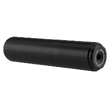
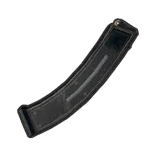
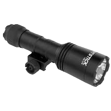
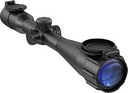

# Equipement

### Gillet par balle

<figure><figcaption>
/giveitem [ID] armour [NOMBRE]
</figcaption></figure>

***

### Silencieux

<figure><figcaption>
/giveitem [ID] at_suppressor_heavy [NOMBRE]
</figcaption></figure>

***

### Chargeur étendu riffle

<figure><figcaption>
/giveitem [ID] at_clip_extended_riffle [NOMBRE]
</figcaption></figure>

***

### Lampe Torche

<figure><figcaption>
/giveitem [ID] at_flashlight [NOMBRE]
</figcaption></figure>

***

### Lunette

<figure><figcaption>
/giveitem [ID] at_scope_medium [NOMBRE]
</figcaption></figure>
