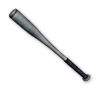
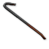
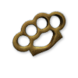
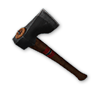
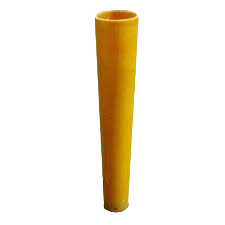
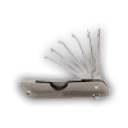
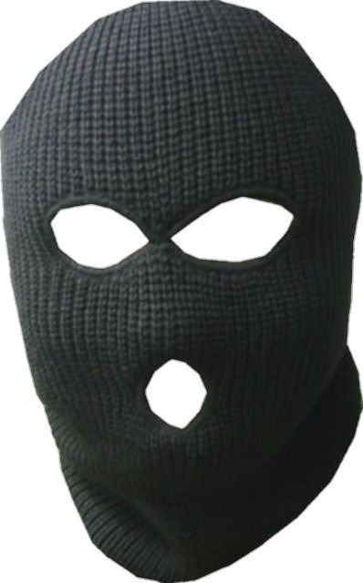
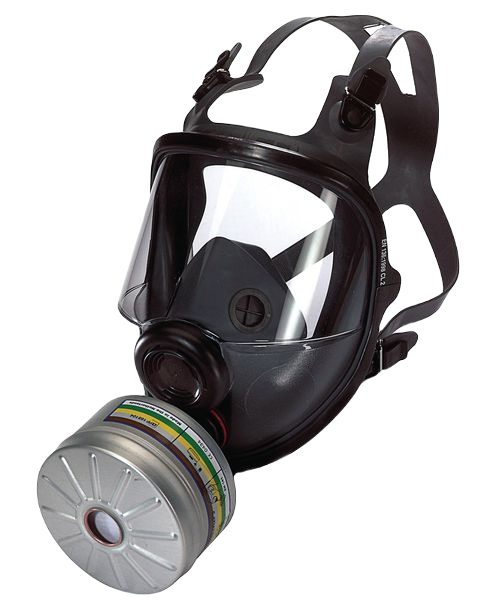
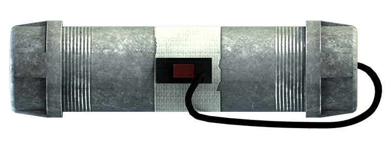
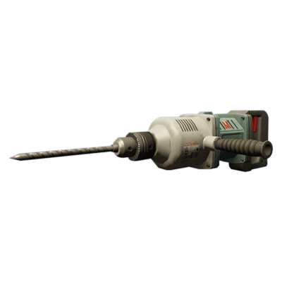

# 💸 Items en vente aux BlackMarket

### Couteau à cran d'arrêt

Prix : 40 000 € en sale

<figure><figcaption>
/giveitem [ID] weapon_switchblade [NOMBRE]
</figcaption></figure>

***

### Batte de baseball

Prix : 20 000 € en sale

<figure><figcaption>
/giveitem [ID] weapon_bat [NOMBRE]
</figcaption></figure>

***

### Bouteille cassée

Prix : 10 000 € en sale

<figure><figcaption>
/giveitem [ID] weapon_bottle [NOMBRE]
</figcaption></figure>

***

### Pied de biche

Prix : 20 000 € en sale

<figure><figcaption>
/giveitem [ID] weapon_crowbar [NOMBRE]
</figcaption></figure>

***

### Machette

Prix : 40 000 € en sale

<figure><figcaption>
(/giveitem [ID] weapon_machete [NOMBRE]
</figcaption></figure>

***

### Poing américain

Prix : 30 000 € en sale

<figure><figcaption>
/giveitem [ID] weapon_knuckle [NOMBRE]
</figcaption></figure>

***

### Hâche de combat

Prix : 40 000 € en sale

<figure><figcaption>
/giveitem [ID] weapon_hatchet [NOMBRE]
</figcaption></figure>

***

### Brique

Prix : 200 € en sale

<figure><figcaption>
/giveitem [ID] weapon_snowball [NOMBRE]
</figcaption></figure>

***

### Mortier artisanale

Prix : 30 000 € en sale

<figure><figcaption>
/giveitem [ID] weapon_firework [NOMBRE]
</figcaption></figure>

Munition de mortier\
Prix : 2 500 € en sale

<figure><figcaption>
/giveitem [ID] ammo-firework [NOMBRE]
</figcaption></figure>

***

### LockPick

Prix : 50 000 € en sale

<figure><figcaption>
/giveitem [ID] lockpick [NOMBRE]
</figcaption></figure>

***

### Cagoule

Prix : 10 000 € en sale

<figure><figcaption>
/giveitem [ID] cagoule [NOMBRE]
</figcaption></figure>

***

### Cutter

Prix : 9 000 € en sale

<figure><figcaption>
/giveitem [ID] cutter [NOMBRE]
</figcaption></figure>

***

### Masque à gaz

Prix : 8 000 € en sale

<figure><figcaption>
/giveitem [ID] gasmask [NOMBRE]
</figcaption></figure>

***

### Bombe thermique

Prix : 30 000 € en sale

<figure><figcaption>
/giveitem [ID] thermite_bomb [NOMBRE]
</figcaption></figure>

***

### Perceuse

Prix : 25 000 € en sale

<figure><figcaption>
/giveitem [ID] drill [NOMBRE]
</figcaption></figure>
